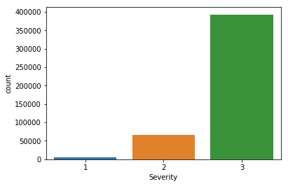
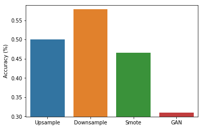
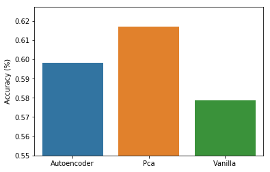

# Predicting Traffic Accident Severity using deep learning
The goal of this project is to predict traffic accident severity using deep learning. The project is split into two parts, 
data re-balancing and representation learning. Data re-balancing is needed as the
data's target is very imbalanced. There is a Graph showing this is at the end of this file. The three methods used were 
random up-sample/down-sample,SMOTE and a GAN. In representation learning, the idea is to use methods of organising the 
data before inputting it to the machine learning model. The techniques used were auto-encoder and Principal Component Analysis (PCA). 

### Layout of project:
This shows the run order of each of the sections of the project. The batch file called do_training.bat will run all files 
sequentially.

**Dataset Preparation:**  
prepare_dataset.py

**Data Rebalance:**  
data_rebalance.py

**Representation Learning:**  
autoencoder.py  
autoencoder_ann.py  
train_pca.py  
vanilla_ann.py  

### Prerequisites
 1) Tensorflow
 2) Keras
 3) Numpy
 4) Imblearn
 5) Matplotlib
 6) Seaborn
 7) TQDM
 8) Sklearn
 
### Results:
  
  

 ### Source of Dataset
https://www.kaggle.com/daveianhickey/2000-16-traffic-flow-england-scotland-wales